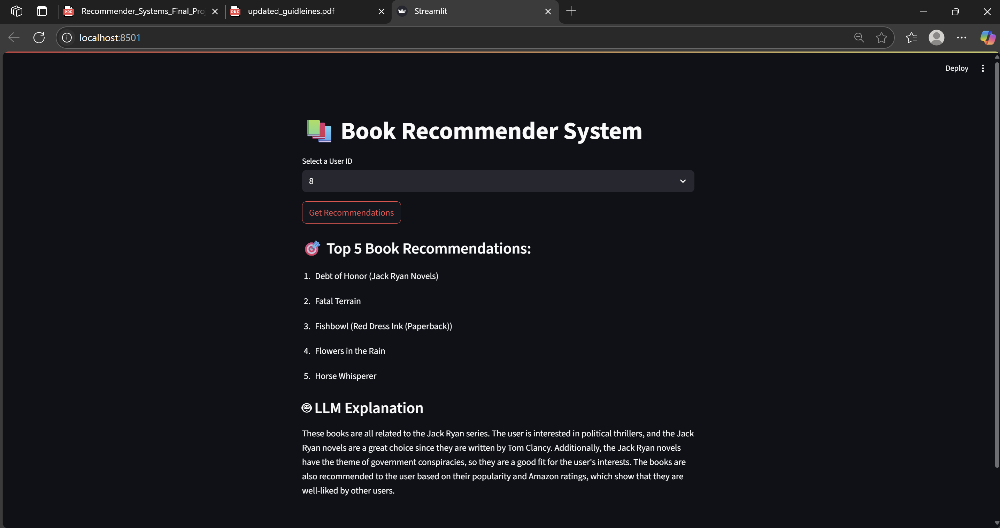

#  Book Recommender System
We are building a book recommender system  using **item-based collaborative filtering** with cosine similarity, enhanced with a **local Large Language Model (LLM)** that explains *why* each recommendation makes sense in order to help readers easily discover new books tailored to their interests. With so many books available online, it’s difficult for readers to find relevant titles that match their preferences. Our goal is to simplify the discovery process by offering personalized recommendations based on each reader’s past behavior.

For our MVP, users will select their profile (User ID) from the dataset. The system will then analyze their past book ratings and generate personalized recommendations for books they have not yet rated. We will use collaborative filtering techniques and the Book-Crossing dataset, which contains over 1 million user-book interactions. The system will be presented through a simple and interactive Streamlit app.

The LLM runs **locally on your machine**, thanks to a lightweight TinyLlama model.  
It reads the recommended books and generates natural language insights to help users understand the logic behind the suggestions, like a smart book assistant!

---
##  Data : download it from kaggle : https://www.kaggle.com/datasets/rxsraghavagrawal/book-recommender-system/data

##  Features

-  User selects a profile (User ID)
-  Recommender analyzes their past book ratings
-  Returns top 5 personalized book suggestions
-  NEW: **LLM explanation** of why those books make sense
-  Interactive **Streamlit UI**
-  Docker support for reproducibility and deployment
-  LLM runs **locally** using [TinyLlama](https://huggingface.co/cg123/TinyLlama-1.1B-Chat-v1.0-GGUF)

---

##  Filtering Logic

- Users with **> 5 ratings**
- Books with **> 10 ratings**

---

##  How to Run (Two Options)

###  Option 1: Local Development (Anaconda)

> Best for development and testing

1. Clone the repo
2. Create the environment:
   ```bash
   conda env create -f environment.yml
   conda activate book_recommender_env
   ```
3. Run the app:
   ```bash
   streamlit run app/app.py
   ```

---

###  Option 2: Dockerized Deployment 

> Easiest for grading and runs anywhere with Docker

1. Start Docker Desktop
2. Build the Docker image:
   ```bash
   docker build -t book-recommender .
   ```
3. Launch the app:
   ```bash
   docker run -p 8501:8501 book-recommender
   ```
4. Open in browser:
   - On your machine: `http://localhost:8501`
   - On phone (same Wi-Fi): `http://<your-laptop-IP>:8501`

---

---

## Project Structure

```
├── app/
│   └── app.py                # Streamlit UI
├── data/
│   └── books.csv, ratings.csv (optional EDA notebook)
├── models/
│   └── llm/
│       └── TinyLlama-1.1B-Chat-v1.0.Q4_K_M.gguf
├── src/
│   ├── preprocessing.py      # Data loading & filtering
│   ├── recommender.py        # CF logic
│   └── llm_explainer.py      # LLM integration
├── environment.yml           # Conda environment
├── requirements.txt          # Used in Docker
├── Dockerfile                # Docker setup
├── README.md                 # This file
```

---

##  Screenshot


---

## 
Developed by Ricardos Abi Akar 
MSc in Data Science & AI Strategy – Final Recommender Systems Project 
